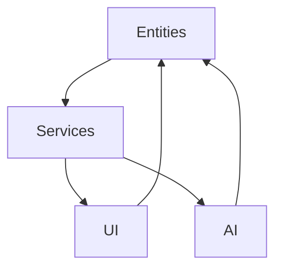
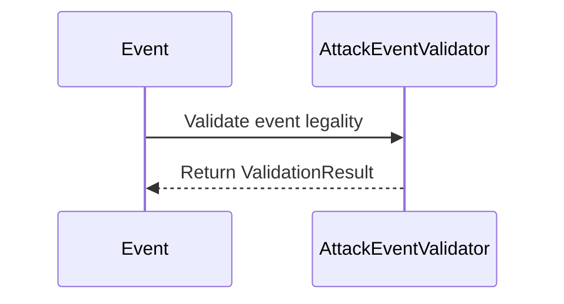
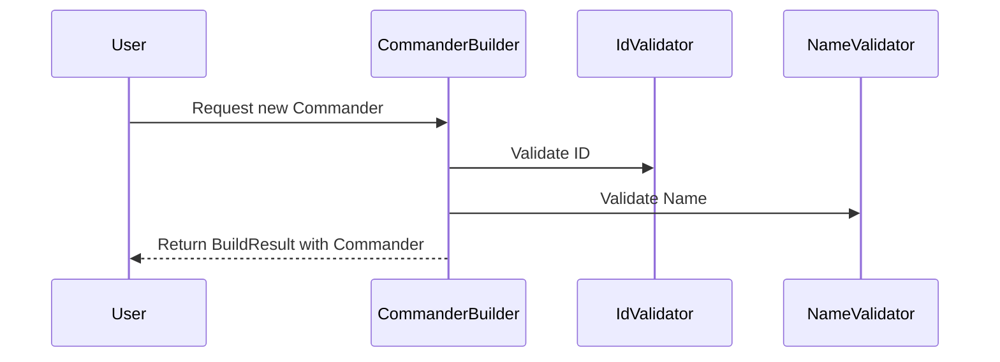
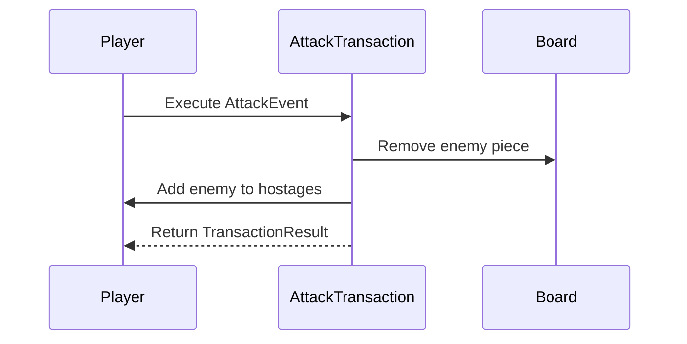
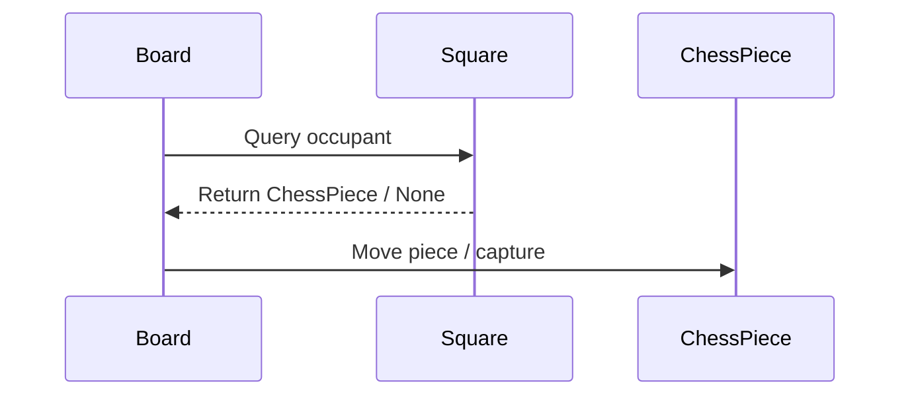
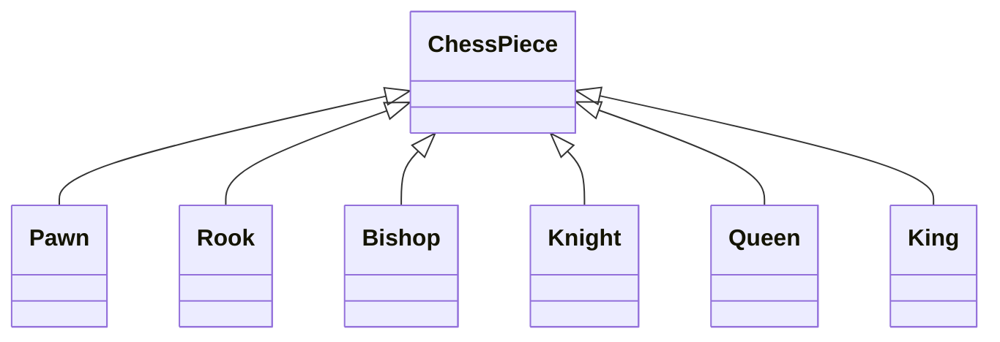
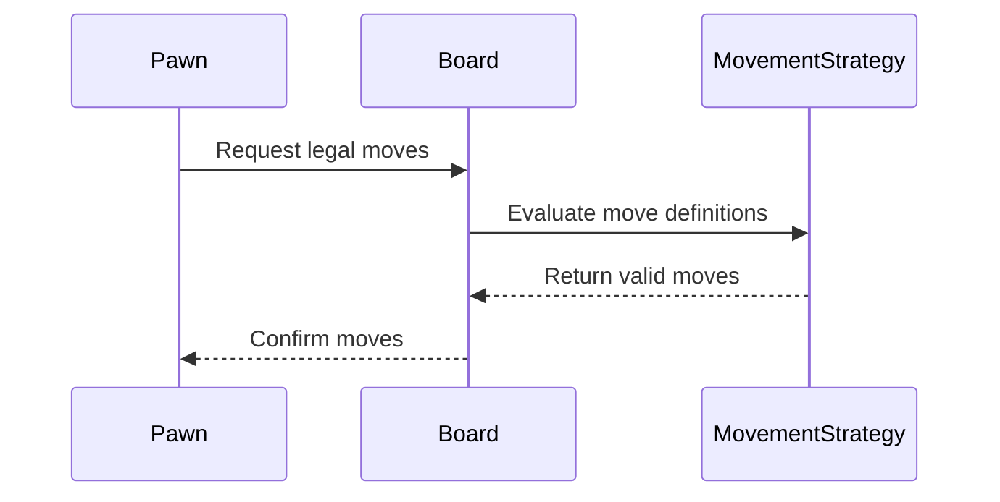
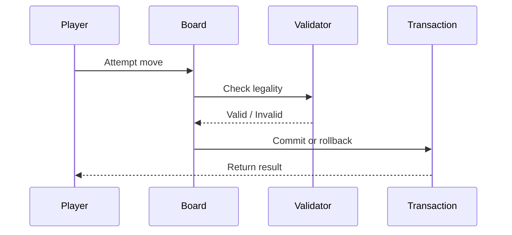
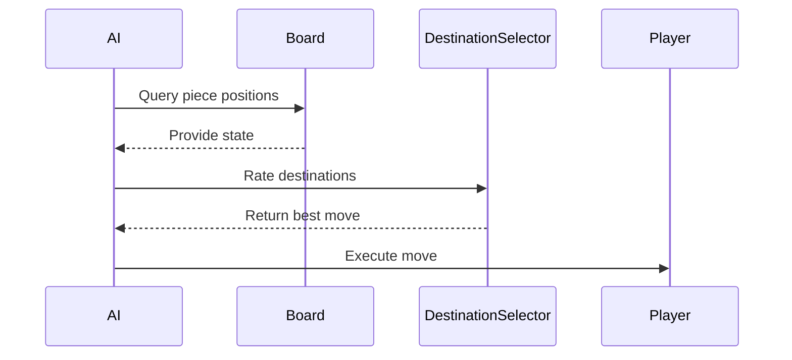
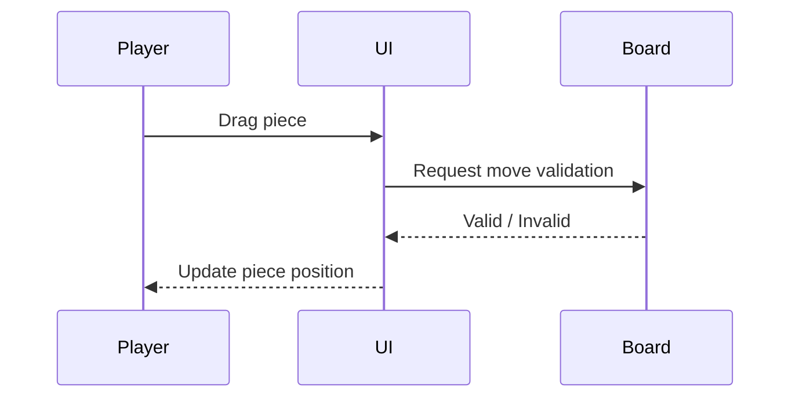

# 📘 ChessBot API & Architecture Guide
> **Author:** Banji Lawal
> **Created:** 2025-10-04
> **Version:** 0.0.1

### Disclaimer
This API is provided **"as is"** and **"as available"** without any warranties of any kind, either express or implied, 
including, but not limited to, the implied warranties of **merchantability**, **fitness for a particular purpose**, 
or **non-infringement**. We do not guarantee that the service will be uninterrupted, timely, secure, or error-free,
and you acknowledge that your use of this API is solely at your **own risk**. We assume **no liability** for any delays, 
inaccuracies, errors, or omissions in any data or information provided through the API, nor for any damages arising 
from its use or inability to use it.

## Table of Contents
1. [Introduction](#introduction) 
  - [Purpose of ChessBot](#purpose-of-chessbot) 
  - [Intended Audience](#intended-audience) 
  - [Scope](#scope)
2. [Features, Use Cases and Requirements](#features-and-their-use-cases)
   - [Easy to Learn A Lot about Chess Feature](#easy-to-learn-alot-about-chess)
    - [Use Cases](#easy-to-learn-use-cases)
    - [Diagrams](#easy-to-learn-use-case-diagrams)
    - [Implied Functional Requirements](#easy-to-learn-functional-requirements)
    - [Implied Nonfunctional Requirements](#easy-to-learn-non-functional-requirements)
   - [Intuitive and Easy to Use Feature](#intutive-and-easy-to-use)
    - [Use Cases](#easy-to-learn-use-cases)
    - [Diagrams](#easy-to-learn-use-case-diagrams)
    - [Implied Functional Requirements](#easy-to-learn-functional-requirements)
    - [Implied Nonfunctional Requirements](#easy-to-learn-non-functional-requirements)
   - [Can Play On Anything Feature](#can-play-on-anything)
    - [Use Cases](#easy-to-learn-use-cases)
    - [Diagrams](#easy-to-learn-use-case-diagrams)
    - [Implied Functional Requirements](#easy-to-learn-functional-requirements)
    - [Implied Nonfunctional Requirements](#easy-to-learn-non-functional-requirements)
   - [Can Play Anywhere Feature](#can-play-anywhere)
    - [Use Cases](#easy-to-learn-use-cases)
    - [Diagrams](#easy-to-learn-use-case-diagrams)
    - [Implied Functional Requirements](#easy-to-learn-functional-requirements)
    - [Implied Nonfunctional Requirements](#easy-to-learn-non-functional-requirements)
   - [Can Play Against a Person or Machine Feature](#can-play-against-person-or-machine)
    - [Use Cases](#easy-to-learn-use-cases)
    - [Diagrams](#easy-to-learn-use-case-diagrams)
    - [Implied Functional Requirements](#easy-to-learn-functional-requirements)
    - [Implied Nonfunctional Requirements](#easy-to-learn-non-functional-requirements)
   - [Resume Where You Left Off Feature](#resume-where-you-left-off)
    - [Use Cases](#easy-to-learn-use-cases)
    - [Diagrams](#easy-to-learn-use-case-diagrams)
    - [Implied Functional Requirements](#easy-to-learn-functional-requirements)
    - [Implied Nonfunctional Requirements](#easy-to-learn-non-functional-requirements)
   - [Review Previous Games Feature](#resume-previous-games)
    - [Use Cases](#easy-to-learn-use-cases)
    - [Diagrams](#easy-to-learn-use-case-diagrams)
    - [Implied Functional Requirements](#easy-to-learn-functional-requirements)
    - [Implied Nonfunctional Requirements](#easy-to-learn-non-functional-requirements)
   - [Data Portability Feature](#data-portability)
    - [Use Cases](#easy-to-learn-use-cases)
    - [Diagrams](#easy-to-learn-use-case-diagrams)
    - [Implied Functional Requirements](#easy-to-learn-functional-requirements)
    - [Implied Nonfunctional Requirements](#easy-to-learn-non-functional-requirements)
3. [Requirements](#requirements)
    - [Functional Requirements](#functional-requirements)
     - [Game Runs Until Player Quits Requirement](#game-runs-until-player-quits)
      - [Policies Satisfying Game Runs Until Player Quits Requirement](#policies-satisfying-run-until-player-quits)
     - [Game Has 99.5% Reliability Requirement](#game-has-995-percent-reliability)
      - [Policies Satisfying 99.5% Reliability Requirement](#policies-satisfying-995-percent-reliability)
     - [Game Automatically Resumes On Startup Requirement](#game-automatically-resumes-on-startup)
      - [Policies Satisfying Resumption on Startup Requirement](#policies-satisfying-game-resumes-on-startup)
     - [Game Behaves Consistently Requirement](#game-behaves-consistently-requirement)
      - [Policies Satisfying Consistent Behavior Requirement](#policies-satisfying-game-behaves-consistently)
     - [No Data is Lost Requirement](#no-data-is-lost-requirement)
      - [Policies Satisfying No Data Loss Requirement](#policies-satisfying-no-data-is-lost)
    - [Non-Functional Requirements][#non-functional-requirements]
     - [Fast Feedback Response Requirement](#fast-feedback)
      - [Policies Satisfying Fast Response Requirement](#policies-satisfying-fast-feedback)
     - [What You See is What it IS Requirement](#wysiwii)
      - [Policies Satisfying Fast Response Requirement](#policies-satisfying-wysiwii)
     - [Usability for Hearing, Colorblind Visually Impaired People Requirement](#usability)
     - [Policies Satisfying Fast Response Requirement](#policies-satisfying-usability)
     - [Looks Nice Requirement](#looks-nice)
     - [Policies Satisfying Fast Response Requirement](#policies-satisfying-looks-nice)
4. [Design Principles](#design-principles)
5. [Architecture Overview](#architecture-overview) 
  - [Core Principles](#core-principles) 
  - [System Layers](#system-layers) 
6. [Core Patterns](#core-patterns) 
  - [Builders](#builders) 
  - [Validators](#validators) 
  - [Results](#results)
  - [Search](#search)
  - [Exceptions](#exceptions) 
  - [Transactions](#transactions) 
  - [Events](#events) 
7. [Core Entities](#core-entities) 
  - [Board](#board) 
  - [ChessPiece](#chesspiece) 
  - [Rank](#rank) 
  - [Player & Team](#player--team) 
  - [CaptureRecord](#capturerecord) 
8. [Movement Strategies](#movement-strategies) 
  - [Motion Definitions](#motion-definitions) 
  - [Strategies](#strategies) 
9. [Validation & Transaction Flow](#validation--transaction-flow) 
  - [Validation Rules](#validation-rules) 
  - [Transaction Lifecycle](#transaction-lifecycle)
10. [AI & Decision Engines](#ai--decision-engines) 
  - [DestinationSelector](#destinationselector) 
  - [Engines](#engines) 
11. [Pygame UI](#pygame-ui) 
12. [API Reference](#api-reference) 
13. [Examples](#examples) 
14. [Roadmap](#roadmap) 
15. [Appendix](#appendix)
16. [Index](#index)

---

## Who this Document is For
<a name="intended-audience"></a>

### Intended Audience
* Developers who want to use the `ChesBo` API
* People interested in seeing all the cool shit you can do with `Python`.
* People who would like to fund further development on this project.

<a name="scope"></a>
### What this Manual Covers
1. The purpose of ChessBot.
2. How we can communicate the purpose by things it can do (features).
3. Howe we show that it does what it says it does (functional and nonfunctional requirements).
4. Design principles that will guide how the parts of the software will be put together.
5. The architecture that flows from the design principles.
6. Roles software components have to so the architecture has strong foundations to assure requirement contracts
  are ment.
7. Organization and structuring of software that provides concrete entities that carry out roles specified
  by design principles.
8. The interface for building applications with `ChessBot`.

## Introduction
<a name="purpose-of-chessbot"></a>
### Purpose of ChessBot
ChessBot A High Performance In-Memory Chess Engine Intelligent Agent with Transactional Move Orchestration
, Centralize Validation and Reactive Notifications. a state management engine that can be deployed anywhere. The
transactional patterns you're establishing will make network distribution, persistence, and scaling much easier later.

ChesBot's teaching engine helps a novice who might feel intimidated by chess into a a 
confident, experienced player willing to take on everyone. ChessBot speeds up the learning curve
with different engines of different complexities. For each person's experience.

ChessBot is about fun chess. How can chess not be fun if a novice player has a good chance of beating 
the machine.

There is the play mode and the teaching mode where the engine plays thousands of games so it can find
patterns and gambits to show people step by step so they can gain mastery.


<a name="features-and-their-use-cases"></a>
## Features and Their Use Cases
When people ask what can they do with it. How does ChessBot give them what they need
even if they didn't know they need it before. The features are one liner saying
what is does and gives them what they need.

The big needs people
* Have are fun.
* Feeding their mastery.
* Discovering new things.
* Meeting new people.

Games give all those things. Chess gives people those things but chess is hard Chess is intimidating for
new people.. `ChessBot` eliminates the barriers and makes it easy to reup your game without anyone seeing 
what it was like to get there.

Those are big promises. Telling is not important. Showing is what counts. Telling people what `ChessBot`
promises to show during the valuable time they have are the features.

### What Do the USe Cases Do
Use cases give something concrete to grab onto. They give examples of ways people might want to use the
features. The use cases here are just a few examples. They are not exhaustive.

<a name="easy-to-improve-chess-ability-feature"></a>
### Easy to Improve Chess Ability Feature
It should be easy to learn a lot about chess quickly.

<a name="easy-to-improve-chess-ability-use-cases"></a>
#### Improving Chess Ability Use Cases
1. A person wants to practice a gambit they have learned.
2. A person wants to have fun beating the machine.
3. The user wants the machine to walk them through a gambit.

<a name="easy-to-improve-chess-ability-use-case-diagrams"></a>
#### Diagram for the Chess Ability Use Cases

<a name="easy-to-improve-chess-abilit-functional-requirements"></a>
#### Implied Functional Requirements
The system has easy controls and menus to select learning options and game options

<a name="easy-to-improve-chess-abilit-functional-requirements"></a>
#### Implied Nonfunctional Requirements
1. The information provided is correct.
2. What the game shows about how to win is easy to follow.
3. Things can be rewound

<a name="systems-providing-easy-to-improve-chess-ability-feature"></a>
#### Systems Supporting Easy to Improve Chess Ability Feature
1. UI
2. Rollback
3. DecisionEngine

<a name="intuitive-and-easy-to-use-feature></a>
### Intuitive and Easy to Use Feature
The game interface and behavior is easy to understand.

<a name="intuitive-and-easy-to-use-use-cases)
#### Intuitive to Use Cases
1. Somebody who does not kow anything about chess or games wants to get started in under 5 minutes.
2. Users want to undo a move while its their turn under 2 seconds.
3. A user wants to change which team they will play before they start playing.
4. The user wants to undo their last choice in the menu. 
5. The user can do everything with only a mouse. 
6. The user can do everything with only the touch screen.

(<a name="intuitive-and-easy-to-use-use-case-diagrams)
#### [Diagrams]

<a name="intuitive-and-easy-to-use-functional-requirements)
#### Implied Functional Requirements
1. Controls are easy to find and use.

<a name="intuitive-and-easy-to-use-non-functional-requirements)
#### Implied Nonfunctional Requirements
1. The user does not need to look at the manual to get started.
2. The layout and behavior of all screens is the same.
3. Selections can be undone and undone.
4. Any settings can be saved.

<a name="systems-providing-intuitive-and-easy-to-use-feature"></a>
#### Systems Providing Intuitive and Easy to Use Feature
1. UI.
2. Rollback
3. Search
4. Event

<a name="can-play-on-anything-feature"></a>
### Can Play On Anything Feature
A user can play on any platform.

<a name="can-play-on-anything-use-cases)
#### Playing on Anything Use Cases
1. A person can play on their mobile phone.
2. A person can play on their tablet.
3. A person can play on through their browser.
4. A person can play on their desktop,

<a name="can-play-on-anything-case-diagrams)
##### [Diagrams]

<a name="can-play-on-anything-functional-requirements)
#### [Implied Functional Requirements]
1. ChessBot can be installed on any platform.
2. ChessBot can be played from the website

<a name="an-play-on-anything-non-functional-requirements)
#### [Implied Nonfunctional Requirements]
1. ChessBot installs with a few clicks.
2. The system explains what is happening at each step of the install.
3. The game behaves the same on all platforms.

<a name="systems-providing-can-play-on-anything-feature"></a>
#### Systems Providing Can Play on Anything Feature
1. Installer
2. JSON Emitter/Consumer API
3. UI
4. Notification


<a name="can-play-anywhere"></a>
### Can Play Anywhere Feature

(#can-play-anywhere-use-cases)
#### Play Anywhere Use Cases
(#can-play-anywhere-diagrams)
#### [Diagrams]
(#can-play-anywhere-functional-requirements)
#### [Implied Functional Requirements]
(#can-play-anywhere-non-functional-requirements)
#### [Implied Nonfunctional Requirements]

<a name="systems-providing-can-play-on-anything-feature"></a>
#### Systems Providing Can Play on Anything Feature
1. Installer
2. JSON Emitter/Consumer API
3. UI
4. Notification

<a name="can-play-against-person-or-machine"></a>
### [Can Play Against a Person or Machine Feature]
(#easy-to-learn-use-cases)
    ##### [Use Cases]
(#easy-to-learn-use-case-diagrams)
    ##### [Diagrams]
(#easy-to-learn-functional-requirements)
    ##### [Implied Functional Requirements]
(#easy-to-learn-non-functional-requirements)
    ##### [Implied Nonfunctional Requirements]
<a name="resume-where-you-left-off"></a>
#### [Resume Where You Left Off]
(#easy-to-learn-use-cases)
    ##### [Use Cases]
(#easy-to-learn-use-case-diagrams)
    ##### [Diagrams]
(#easy-to-learn-functional-requirements)
    ##### [Implied Functional Requirements]
(#easy-to-learn-non-functional-requirements)
    ##### [Implied Nonfunctional Requirements]
<a name="resume-previous-games"></a>
#### [Review Previous Games]
(#easy-to-learn-use-cases)
    ##### [Use Cases]
(#easy-to-learn-use-case-diagrams)
    ##### [Diagrams]
(#easy-to-learn-functional-requirements)
    ##### [Implied Functional Requirements]
(#easy-to-learn-non-functional-requirements)
    ##### [Implied Nonfunctional Requirements]
<a name="data-portability"></a>
### [Data Portability]
    ##### [Use Cases](#easy-to-learn-use-cases)
    ##### [Diagrams](#easy-to-learn-use-case-diagrams)
    ##### [Implied Functional Requirements](#easy-to-learn-functional-requirements)
    ##### [Implied Nonfunctional Requirements](#easy-to-learn-non-functional-requirements)
<a name="requirements"></a>
### [Requirements]
(#functional-requirements)
   #### [Functional Requirements]
(#game-runs-until-player-quits)
    ##### [Game Runs Until Player Quits]
(#policies-satisfying-run-until-player-quits)
     ###### [Policies Satisfying Game Runs Until Player Quits Requirement]
    ##### [Game Has 99.5% Reliability](#game-has-995-percent-reliability)
(#policies-satisfying-995-percent-reliability)
     ###### [Policies Satisfying 99.5% Reliability Requirement]
(#game-automatically-resumes-on-startup)
    ##### [Game Automatically Resumes On Startup]
(#policies-satisfying-game-resumes-on-startup)
     ###### [Policies Satisfying Resumption on Startup Requirement]
(#game-behaves-consistently-requirement)
    ##### [Game Behaves Consistently]
     ###### [Policies Satisfying Consistent Behavior Requirement]
(#no-data-is-lost-requirement)
    ##### [No Data is Lost]
(#policies-satisfying-no-data-is-lost)
     ###### [Policies Satisfying No Data Loss Requirement]
<a name="non-functional-requirements)
#### [Non-Functional Requirements]
    ##### [Fast Feedback Response](#fast-feedback)
     ###### [Policies Satisfying Fast Response Requirement](#policies-satisfying-fast-feedback)
    ##### [What You See is What it IS](#wysiwii)
     ###### [Policies Satisfying Fast Response Requirement](#policies-satisfying-wysiwii)
    ##### [Usability for Hearing, Colorblind Visually Impaired People](#usability)
     ###### [Policies Satisfying Fast Response Requirement](#policies-satisfying-usability)
    ##### [Looks Nice](#looks-nice)
     ###### [Policies Satisfying Fast Response Requirement](#policies-satisfying-looks-nice)
    ##### [Multiplayer Chat](#multiplayer-chat)
     ###### [Policies Satisfying Fast Response Requirement](#policies-satisfying-multiplayer-chat)

<a name="design-principles)
## Design Principles
The fundamental technical requirement to satisfy user contracts are
* High speed
* High reliability
* Low data usage
* Low bugs 
* No crashes.
* Correctness

#### Actions Which Produce the Technical Requirement
1. **Separating Concerns:** Easier bug tracking isolating components to speed up development.
2. **Low Coupling:** Components that depend on each other for satisfying their separated concerns must be
 loosely coupled.
3. **High Cohesion:** Between components that are doing related things or fulfilling a task.
4. **Single Responsibility:** There must be one source of truth for an operation or data source.

#### How the Development Actions Help Deliver a Product that Meets Requirement
* They make it easier to ensure effectiveness of each component with metrics.
* They make it easier to ensure reliability and consistency with unit tests.

### About Unit Tests
Every class will be unit tested on its fields and methods.


low bugs. These are easier to meet when an application is modular. And there is high cohesion within modules, low
coupling within and between modules.

The core design principle which meets the technical requirements is separation of concerns.

---
## 
## Architecture Overview
<a name="core-principles"></a>
### Core Principles
High performance
Lightweight 
Stable and reliable
Never looses data 
Playable on mobile, web, or desktop.

To achieve these the architecture has to be
- Modular for separating concerns, responsibilities and testing.
- Testable
- FAil gently/never crash
- If it crashes no data is lost and game play resumes where it left off.
- Games can be saved.

To achieve all these architecture implements rollbacks on failure. Separates data-holding objects 
from state/behavioral objects.

<a name="system-layers"></a>
### System Layers
The major layers are based on the core design principles of separating concerns into highly cohesive modules 
loosely coupled to each other.

1. Data
2. Business Logic
3. User Interface

Performance and reliability contracts are met with structures and operations that
1. Transfer state between layers.
2. Monitor and maintain consistency.
3. Dispatch request between components within and without layers and subsystems.
4. Send responses back to clients.


- Data protection and ACID; validators, transactions.
- Data creation; builders.
- Data transfer; results and events.
- Coordination; servers and controllers.

and which should be used publicly and which are interfaces to classes 
holding state.



---

## Core Patterns
The patterns are the responsibilities classes can have
1. Building
2. Validation
3. Data holding
4. Service request (Event)
5. Service provider (Transaction)
6. Service response (Transacti)

### Build Service Provider
Builder are responsible for safely creating entities. They perform comprehensive validation checks during construction
ensuring consistent patterns. Separating object creation provides a consistent workflow, flexibility, separates concerns. 

A builder runs through validation checks sequentially. If a check fails an `Exception` specific to that failure condition
is wrapped inside an `EntityBuildFailedException`. This speeds debugging and provides a single source of truth for an
object's build history.


    Performs individual validation checks on each component to ensure the resulting `Piece` meets all
    specifications. If all checks are passed, a `Piece` instance will be returned. It is not necessary to perform
    any additional validation checks on the returned `Piece` instance. This method guarantees if a `BuildResult`
    with a successful status is returned, the contained `Piece` is valid and ready for use.

1. Encapsulate complex logic with dependent entity validators
2. Simplify code.
3. Reduce boiler plate
4. Single source of truth for building errors by wrapping

### Validation Service Provider
*(placeholder for Validators explanation)*



### Builders versus Validators
A `Builder` ensure objects are created correctly or not at all. An `Validator` ensures existing objects passes around
the system passed sanity checks.

      The build runs through all the checks on parameters and state to guarantee only a valid `Piece` is
      created, while `PieceValidator` is used for validating `Piece` instances that are passed around after
      creating. This separation of concerns makes the validation and building independent of each other and
      simplifies maintenance.

### Recommended Builder Workflow

```python
from chess.team import Team
from chess.rank import Knight
from chess.piece import CombatantPiece, PieceFactory

build_result = PieceFactory.build(name="WN2", rank=Knight(), team=white_team)
if not build_result.is_success():
    raise build_result.exception

piece = cast(CombatantPiece, build_result.payload)
```
### Sequence Diagram for the Usage Example


### See Also:
 - `Validator`: Used for validating existing objects
 - `BuildResult[`T`]`: Return type containing the built `T` or exception information


#### Transaction Service Request (`Event`) The 
  A data-holding object representing an`actor`'s intent to perform a state-changing operation with a
  `resource`. An `Event` is passed to a `Transaction` instance that fires and manages the event lifecycle.
  During the event lifecycle the `actor` manipulates the `resource`.

# PURPOSE
A package providing an immutable hierarchy for events and transactions manging event lifecycle. An event is
 an object representing an intent to perform a state-changing operation with a resource by an actor.
 Each event lifecycle is managed by a `Transaction` instance.

 ACID transactions are a functional requirement for the chess game. The `Transaction` class rolls back actors
 and resources if there is a data inconsistency a `RollBackException` is raised after `actor` and `resource` are
 restored to their last good state.

# Notes:
  DO NOT USE THESE EXCEPTIONS DIRECTLY. Limited use in the finally statement of a try-except block.


### Results
Operations and methods that return data raise exceptions if inputs break business rules or 
run into edge cases. Raising exceptions crashes the application which violates a core feature.

#### Policy for Fulfilling Reliability Requirement
Return exceptions to the caller for soft handling or rolling back.

#### Mechanism for Policy Enforcement
`Result` Abstract Data Type that holds data returned from accessor method or exception it threw.
`Result` is the super class for all data-holding objets which represent outcome of operations that 
produce one of two results only.
 1. Success: A payload is returned
 2. Failure: An exception is raised

#### Source Package and Importing
- `chess.system.result

##### Importing `Result` Class
Do not import the terminal package. This will be messy and difficult to keep track of. Each 

##### Fields
 * `_payload` (`Optional`[`T`]): The payload of the result, if the operation called.
 * `_exception` (`Optional`[`Exception`]): The error raised if the operation called failed.

##### Methods
 * `is_success()` -> `bool`: Returns True if the result is successful (i.e., has a payload only).

 A Result object encapsulates the outcome of methods and operations that return an object. Different from
 TransactionResult which assures an existing object's state changed correctly without causing inconsistencies.

##### RECOMMENDED USE CASES
 * Validation of existing objects.
 * Objects returned by accessors and query methods.
 * Operations that return an object, but may fail due to business logic or other reasons.
 * Methods that may fail due to external factors (e.g., network issues, file I

#### `Result` Exceptions 

#### `Result` Subclasses
1. `BuildResult`
2. `ValidationResult`
3. `TransactionResult`

#### UML Hierarchy Diagram

##### SEE ALSO
`ValidationResult`, `TransactionResult`, `BuildResult`, `SearchResult`, `Transaction`, `Event`,
`Builder`, `Validator`, `Search`

### Search
#### Search Results

### Exceptions
Conditions which violate business logic, raise data inconsistencies or break operations raise an exception.
Exceptions aid bug tracking and maintenance. Exceptions can only break the system in development. In production
an exception will display a notification and return to the last good state after the user makes a choice. All
exceptions in the application are subclasses of `ChessException`. This distinguishes `ChessBot` exceptions from 
others.

#### The `ChessException` Class
The class has two static fields.
 - `ERROR_CODE` (`str`): Useful in log tracing. Error codes have the <i>_ERROR</i> suffix.
 - `DEFAULT_MESSAGE` (`str`): Sentence describing the condition that raised the `ChessException`.

The `DEFAULT_MESSAGE` should be used when a `ChessException` is raised. This gives consistency and cuts down on
work. All subclasses must have an `ERROR_CODE` and `DEFAULT_MESSAGE`

#### Direct Subclasses of `ChessException`
* `FailedBuildException`
* `ValidationException`
* `PieceException`
* `TeamException`
* `CoordException`
* `CommanderException`
* `BoardException`
* `SquareException`
* `NullException`
* `RollbackException`
* `EventException`
* `SearchException`
* `TransactioException`
* `ScalarExecption`
* `VectorException`
* `MovingException`
* `AreanException`

All the exceptions have the same static fields `ERROR_CODE` and `DEFAULT_MESSAGE`. Classes that carry results;
`Result`, `BuildResult`, `ValidationResult`, `TransactionResult` and 'SearchResult` may only raise exceptions
about mutual exclusion requirements in their fields.'


#### The Exception Workflow
There isn't anything different different about raising and catching `ChessException`s. I just want to illustrate
how the error code and default message should be used.
---
```python

# import the ChessException from chess.system
from chess.system import ChessException 

# Create the subclass
class RollbackFailedException(ChessException):
  ERROR_CODE = "ROLLBACK_FAILED_ERROR"
  DEFAULT_MESSAGE = "Rollback failed."

# Using the custom rollback_exception
def handle_fault(rolled_back_data, original_data):
  if not rolled_back_data == original_data:
    raise RollbackFailedException(RollbackFailedException.DEFAULT_MESSAGE)
```
---
Note the default message is used when creating an exception instance, not the error code. The error code
is used in searching the logs.

### Transactions
*(placeholder for transaction explanation)*



### Events
*(placeholder for event explanation)*

---

## Core Entities
### Board
*(placeholder for board explanation)*



### ChessPiece
*(placeholder for ChessPiece explanation)*



### Rank
*(placeholder for Rank explanation)*

### Player & Team
*(placeholder for Player and Team explanation)*

### CaptureRecord
*(placeholder for CaptureRecord explanation)*

---

## Movement Strategies
### Motion Definitions
*(placeholder for motion definitions explanation)*

### Strategies
*(placeholder for movement strategies explanation)*



---

## Validation & Transaction Flow
### Validation Rules
*(placeholder for validation rules explanation)*

### Transaction Lifecycle
*(placeholder for transaction lifecycle explanation)*



---

## Features & Use Cases
### Functional Requirements
*(placeholder for functional requirements text)*

### Non-Functional Requirements
*(placeholder for non-functional requirements text)*

---

## AI & Decision Engines
### DestinationSelector
*(placeholder for DestinationSelector explanation)*

### Engines
*(placeholder for Engines explanation)*



---

## Pygame UI
*(placeholder for Pygame UI explanation)*



---

## API Reference
*(placeholder for Builders, Validators, Transactions, Events, Exceptions reference)*

---

## Examples
*(placeholder for code examples, usage, JSON input/output)*

---

## Roadmap
*(placeholder for planned features, AI enhancements, UI improvements)*

---

## Appendix
### Glossary of Terms
*(placeholder for glossary)*

### Error/Exception Codes
*(placeholder for error/exception codes)*
