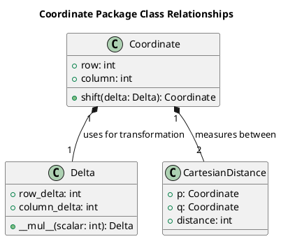

# `chess.boarrd` Package Documentation

## Table of Contents
- [📌 Purpose](#-purpose)
- [Design Principles](#design-principles)
- [Class Relationship Diagram](#class-relationship-diagram)
- [🧩 Classes](#-classes)
  - [Coordinate](#coordinate)
  - [Delta](#delta)
  - [CartesianDistance](#cartesiandistance)
- [Usage Examples](#usage-examples)
  - [Basic Operations](#basic-operations)
- [Class Exceptions](#class-exceptions)

## 📌 Purpose
Provides geometric primitives for chess board coordinates:
- `Coordinate`: Represents board positions (row, column)
- `Delta`: Vector for coordinate transformations
- `CartesianDistance`: Measures distances between coordinates

## Design Principles
 - Immutability: Thread-safe operations
 - Validation: Strict constructor checks
 - Performance: Integer math optimized for chess
 - Type Safety: Python type hints throughout

## Class Relationship Diagram


## 🧩 Classes

### `Coordinate`
```python
class Coordinate(row: int, column: int)
```
Immutable chess board position

#### Attributes:
 - row (int): 0 to ROW_SIZE-1
 - column (int): 0 to COLUMN_SIZE-1

#### Methods:
```python
 # Returns new translated position
 shift(delta: Delta) -> Coordinate:
```

```python
 # Multiplies row and column by scalar to get new Coordinate
 __mult__(scalar: int) -> Coordinate: 
```

#### Validation:
 - Rejects None values (`NollChessObjectException`)
 - Enforces board bounds (`CoordinateOutOfBoundsException`)

### Class `Delta`
```python
class Delta(row_delta: int, column_delta: int) -> Coordinate:
```
Immutable transformation vector used  with `Coordinate.shift()`

#### Attributes
 - row_delta (int): Row component
 - column_delta (int): Column component

### Class `CartesianDistance`
```python
class CartesianDistance(p: Coordinate, q: Coordinate) -> int:
```
Immutable class with Square o Euclidean distance between `p` and `qq`

#### Attributes
 - p, q (Coordinate): Compared positions
 - distance (int): (p.row-q.row)² + (p.column-q.column)²

## Usage Examples

### Basic Operations
#### Instantiating `Coordinate`
```python
p = Coordinate(row=0, column=0)
q = Coordinate(2, 3)
```
Best practice explictly state parameters so which is row and column.

#### Delta Shifting

```python
delta = Delta(row_delta=1, column_delta=-1)
p = Coordinate(2, 3)
r = p.shift_by_offset(delta)
```

#### Scalar Multiplication
```python
p = Coordinate(2, 3)
r = p.__mul__(3)
```

#### Finding CartesianDistance
```python
p = Coordinate(2, 3)
q = Coordinate(4,5)
distance = CartesianDistance(p, q)
```

## Class Exceptions
Exceptions for tracing source of exceptions with a `Coordinate`.

 - `CoordinateException`: General thrown by a `Coordinate` object.
 - `RowOutOfRangeException`: Thrown if `Coordinate.row` outside the `ChessBoard` dimensions.
 - `COlumnutOfRangeException`: Thrown if `Coordinate.column` outside the `ChessBoard` dimensions.