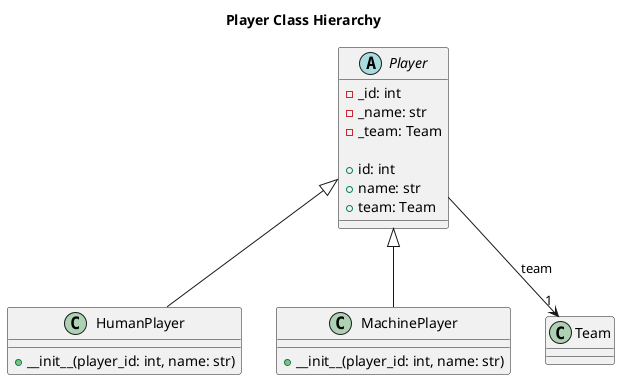

# Uml Relationship Diagram

```plantuml
@startuml
title Player Class Hierarchy

abstract class Player {
 - _id: int
 - _name: str
 - _team: Team

 + id: int
 + name: str
 + team: Team
}

class HumanPlayer {
 + __init__(player_id: int, name: str)
}

class MachinePlayer {
 + __init__(player_id: int, name: str)
}

Player <|-- HumanPlayer
Player <|-- MachinePlayer

Player --> "1" Team : team

@enduml
```