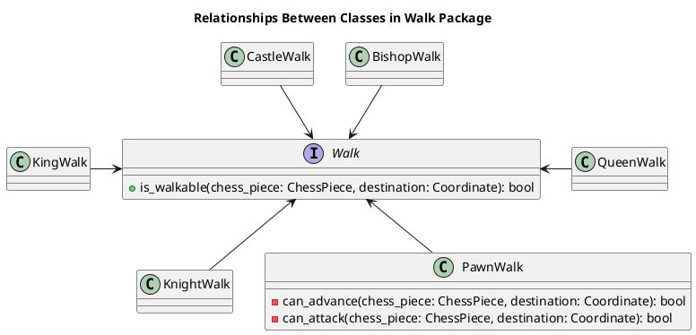

# `chess.walk` Package Documentation

## Table of Contents

### Purpose
Tests if `ChessPiece` instance can reach a destination with constraints on motion by its `Rank`.

## Design Principles
 - Strategy pattern for scalable maintainable independent movement validation.
 - Fast validation with simple boolean test.
 - Single objets in system with static methods.

## Class Relationship Diagram

## Classes

## Class Relationship Diagram


## 🧩 Classes

### `Walk Interface`

#### Methods:
Abstract, static class which must be implemented
```python
 # Returns true if the destination is reachable from the chess_piece location
is_walkable(chess_piece: ChessPiece, destination: Coordinate) -> bool:
```

#### Validation:
 - Rejects Null ChessPiece  (`NullChessPieceException`)
 - rejects Null Coordinate (`NullCoordinateException`)

### `Walk` Interface Implementors
- `KingWalk`
- `PawnWalk`
- `KnightWalk`
- `BishopWalk`
- `CastleWalk`
- `QueenWalk`

```python

## Usage Examples

### `ChessPiece` Validating `Coord` is Reachable Before Executing Walk
```python
destination = Coordinate(2, 3)
origin = chess_piece.positions.current_coord

if not chess_piece.rank.is_walkable(chess_piece, destination):
    raise DestinationUnreachableException(
        f"ChessPiece {chess_piece.name} "
        f"cannot reach {destination} "
        f"from its current coord {origin}"
    )
chess_board.capture_square(chess_piece, destination)
```
## Class Exceptions
Exceptions for tracing source of exceptions with a `Walk` contractors.

 - `DestiantionUnreachableException`: Thrown when an attempt to walk to a destination fails.
 - `QueenWalkException(DestinationUnreachableException)`
 - `KnightWalkException(DestinationUnreachableException)`
 - `KingWalkException(DestinationUnreachableException)`
 - `BishopWalkException(DestinationUnreachableException)`
 - `CastleWalkException(DestinationUnreachableException)`

### Pawn Exceptions
Its helpful to have exceptions for specific PawnWalk failures
 - `PawnWalkException(DestinationUnreachableException)`: Helpful to have a hierarchy of pawn exceptions
 - `PawnAdvanceException(PawnWalkException)`
 - `PawnAttackException(PawnWalkException)`
 - `UnsatisfiedPawnWalkPreConditionException(PawnWalkException)`
